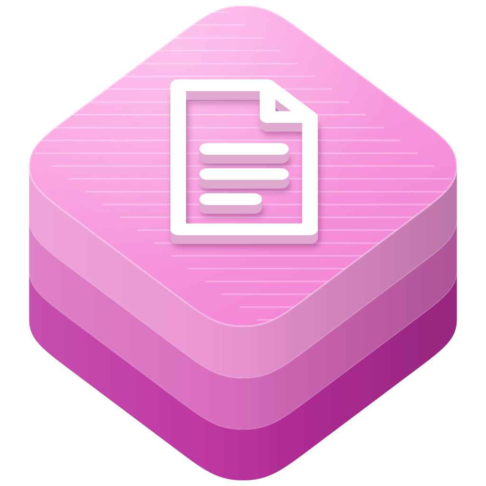

<p align="center">
  
</p>

<h1 align="center">swift-pdf</h1>

<p align="center">
  Display, navigate, search, and overlay PDF documents in SwiftUI.
</p>

<p align="center">
  <a href="https://github.com/swift-library/swift-pdf/actions/workflows/ci.yml"></a>
  
  
  <a href="LICENSE.txt"></a>
</p>

[Overview](#overview) · [Install](#install) · [Quick start](#quick-start) ·
[Usage](#usage) · [Requirements](#requirements) · [Documentation](#documentation) ·
[Contributing](#contributing) · [License](#license)

> [!NOTE]
> swift-pdf is pre-1.0. Minor releases may include source-breaking changes,
> so depend on it with `.upToNextMinor(from:)`.

## Overview

swift-pdf brings PDFKit's viewer into SwiftUI through the `PDF` module. Open
an existing document, PDF data, or a file URL; configure its display through
`.pdf` modifiers; and connect your own controls through `PDFViewReader`.

- Navigate pages, zoom, and select search results through `PDFViewProxy`.
- Observe settled page, scale, and search state through SwiftUI bindings.
- Add SwiftUI content to individual pages with overlay lifecycle callbacks.
- Use the same viewing API on iOS, macOS, and visionOS.

## Install

Add the package and its `PDF` product to `Package.swift`:

```swift
dependencies: [
  .package(
    url: "https://github.com/swift-library/swift-pdf.git",
    .upToNextMinor(from: "0.1.0")
  ),
],
targets: [
  .target(
    name: "YourTarget",
    dependencies: [
      .product(name: "PDF", package: "swift-pdf"),
    ]
  ),
]
```

## Quick start

Pass a PDFKit document to the viewer and connect a page control:

```swift
import PDF
import PDFKit
import SwiftUI

@MainActor
struct DocumentReader: View {
  let document: PDFDocument
  @State private var currentPage = 0
  @State private var pageCount = 0

  var body: some View {
    PDFViewReader { proxy in
      VStack {
        PDF(document: document)
          .pdf.displayMode(.singlePageContinuous)
          .pdf.autoScales(true)
          .pdf.currentPage($currentPage)
          .pdf.pageCount($pageCount)

        HStack {
          Text("Page \(currentPage + 1) of \(pageCount)")
          Button("Next") { proxy.goToNextPage() }
        }
      }
    }
  }
}
```

A reader connects one descendant `PDF` viewer. Page indexes are zero-based.
Use proxy commands to navigate; page and scale bindings report PDFKit's
settled state. Writing those output bindings does not navigate the viewer.

## Usage

`PDF(source:)` accepts `.document`, `.data`, or `.fileURL`. Loading is handled
by PDFKit. Prepare a `PDFDocument` yourself when your interface needs to
handle a loading error before displaying the viewer.

Use `.pdf.displayDirection`, `.pdf.autoScales`, and `.pdf.isInMarkupMode` to
configure a viewer. Applying configuration to a parent view supplies defaults
for its descendant viewers.

Bind `.pdf.searchQuery` and `.pdf.searchOptions` to control a search. Observe
matches through `.pdf.searchResults`, `.pdf.searchResultCount`, and
`.pdf.searchResultIndex`; use the proxy to select a result. A query change
updates matches without automatically navigating.

Use `.pdf.overlay` to draw SwiftUI content on a page and `.pdf.overlayRelease`
to release associated resources when its overlay leaves the view lifecycle.

The [getting started](Sources/PDF/PDF.docc/GettingStarted.md),
[search](Sources/PDF/PDF.docc/SearchingDocuments.md), and
[page overlay](Sources/PDF/PDF.docc/PageOverlays.md) guides contain complete
examples and behavior details.

## Requirements

- Swift 6.2 or later.
- iOS 18+, macOS 15+, or visionOS 2+.
- SwiftUI and PDFKit; the package has no external package dependencies.

## Documentation

- [PDF module and API index](Sources/PDF/PDF.docc/PDF.md)
- [PDFViewer example](Examples/PDFViewer)
- [Versioning and release policy](Documentation/Architecture/VersioningAndRelease.md)
- [Release guide](Documentation/Reference/ReleaseGuide.md)

## Contributing

See [Contributing](CONTRIBUTING.md). Run `Scripts/check` for the package's
formatting, builds, tests, simulator checks, and compiling DocC examples.

## License

[Apache-2.0 WITH Swift-exception](LICENSE.txt). See [NOTICE](NOTICE) for
source ownership and attribution.
